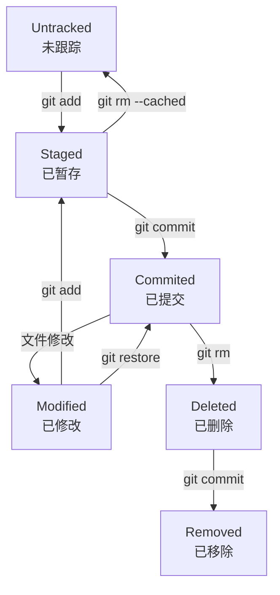

git 有很多二级命令,git主要操作也是通过二级命令

## 配置

在使用git之前要先配置用户信息,否则不能执行后续commit操作

```sh
# 配置全局用户信息
# 也可不指定 --global 参数单独为每一个项目配置
git config --global user.name "lide"
git config --global user.email '2747217918@qq.com'

# 显示当前的Git配置
git config --list

# 编辑配置文件,使用系统默认编辑器(nano/vi/...)
git config -e [--global]

# 指定编辑器
git config --global core.editor 'vi'
```

## 开始使用

### 初始化仓库

```sh
# 新建dir目录,在其创建git仓库(.git)
# 不指定dir为当前目录
git init [options] [dir]
```

|      option      | description           |
| :--------------: | --------------------- |
|    -q,--quit     | 只输出错误、警告信息            |
|      --bare      | 创建bare仓库，没有工作区，用于远程仓库 |
| --initial-branch | 指定初始分支名称              |
### 进入工作区

```sh
lide@main:~/gits$ git init d1 && cd d1 && ls -a
Initialized empty Git repository in /home/lide/gits/d1/.git/
.  ..  .git
```

### 文件状态

用于检查工作区中指定文件的状态

```sh
git status [options] [file... (default:all)]
```

| options      |      |
| ------------ | ---- |
| -s,--short   | 简单输出 |
| -v,--verbose | 详细输出 |

| 文件状态             | 简易格式(-s参数) |
| ---------------- | ---------- |
| 未追踪新文件 Untracked | ??         |
| 已暂存 Staged       | A          |
| 修改已提交 Modified   | M          |
| 修改暂存未提交 Modified | AM         |
| 删除已提交 Deleted    | D          |
| 分支合并冲突文件         | UU         |
| 已提交 Commited     | 不显示        |


### 添加文件

```sh
git add [<file>|.]
```

添加指定文件或所有文件到暂存区

### 提交

```sh
git commit -m '这是第一次提交记录'
```

### 添加

添加文件到当前工作空间中。如果你不使用 git add 将文件添加进去，那么这些文件也不会添加到之后的提交之中

```sh
# name可以是一个或多个文件和目录,支持正则
git add [file]/.

# 添加每个变化前，都会要求确认.
# 对于同一个文件的多处变化，可以实现分次提交
git add -p
```

### 删除

和上面的 add 命令相反，从工作空间中去掉某个文件

```sh
git rm [file]/*

--cached	#停止追踪指定文件，但该文件会保留在工作区
-n	#模拟删除
-f	#强行删除
-r	#允许递归删除，即多级目录
```

### 提交

```sh
#提交暂存区文件到仓库区 message是提交信息
#-v是必须参数。若不写会打开一个文本编辑器写message
git commmit -m 'message'

# 提交暂存区的指定文件到仓库区
git commit [file1]... -m 'message'

-a	#将所有已跟踪文件的更改都提交，无需add。如果有新增的未跟踪文件，它们不会被提交。你需要使用 git add 将它们加入暂存区。
-v	#提交时显示详细的差异信息
--amend	#追加变更到上一次一次提交。可用来多次修改某一次提交

# 回退到某一个提交
git reset <commit>
--soft # 不更改工作区和暂存区,仅删除提交
--mixed # 不更改工作区,取消修改(暂存区),删除提交
--hard # 工作区,暂存区都删除
```

### 分支


```sh
# 所有本地分支
git branch 
-r # 所有远程分支
-a # 所有本地和远程分支
-m [old] [new] #重命名
git branch [name] --edit-description # 编辑分支的介绍

git branch [name] # 新建一个分支，但依然停留在当前分支

git checkout [branch-name] # 切换到指定分支，并更新工作区
git checkout -b [name] # 新建一个分支，并切换到该分支
git checkout - # 切换到上一个分支

git branch [name] [commit] # 新建一个分支，指向指定commit

# 新建一个分支，与指定的远程分支建立追踪关系
git branch --track [branch] [remote-branch]
# 建立追踪关系，在现有分支与指定的远程分支之间
git branch --set-upstream [branch] [remote-branch]

git merge [branch] # 合并指定分支到当前分支
git merge origin/[branch] # 合并远程分支至当前分支

# 删除分支
git branch -d [name]
# 删除远程分支
git push origin --delete [branch-name]
git branch -dr [remote/branch]

# 选择一个commit，合并进当前分支
git cherry-pick [commit]

```

### 日志

```sh
git log # 显示所有提交
--merges #仅显示合并提交
--stat #查看提交统计信息

# 显示某几条提交信息
git log -n 10

# 查看该文件每次提交记录
git log <file>

# 查看每次详细修改内容的diff
git log -p <file>

# 查看最近两次详细修改内容的diff
git log -p -2
```

